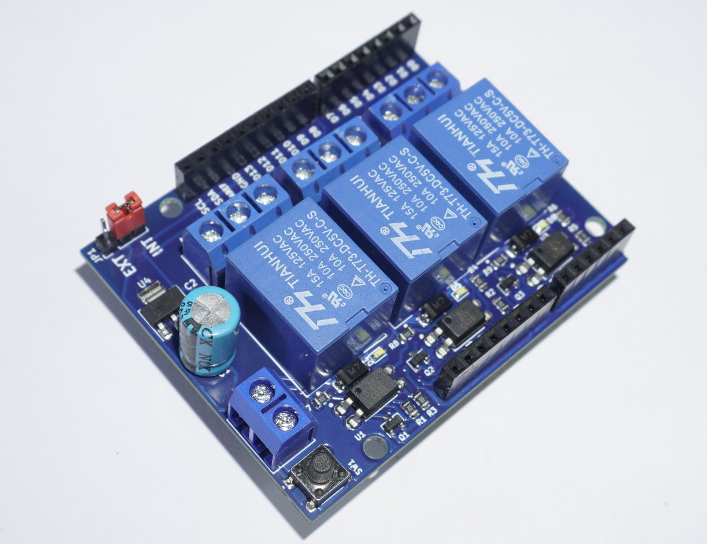

# Arduino Relay Shield

The Arduino Relay Shield allows your Arduino driving high power loads. The Arduino Relay Shield allows your Arduino driving high power loads. The Shield features three relays, each relay provides 2 pole changeover contacts (NO and NC); in order to increase the current limit of each output the 2 changeover contacts have been put in parallel. Three LEDs indicate the on/off state of each relay.

## General Features
- 3 Channel 5V Relays
- Long Male to Female Headers
- In-built LEDs
- Dimensions:68.5x53.3 mm
- Mass: 50 grams
- Operating Voltage: 5V
- AC Control Voltage: 7A 250V
- DC Control Voltage: 12A 210V

